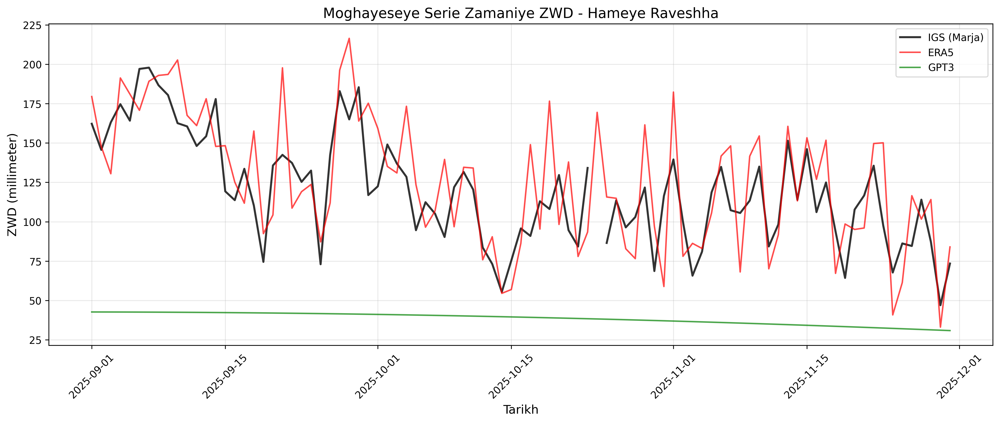
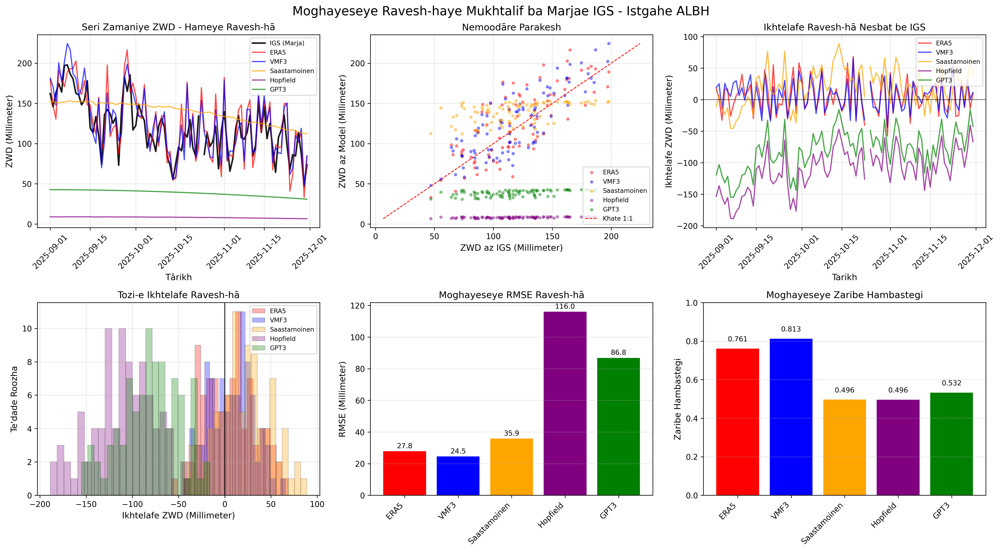
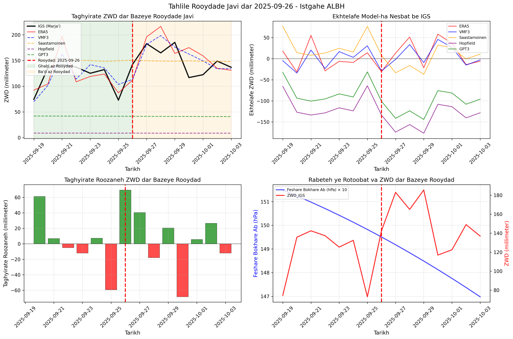
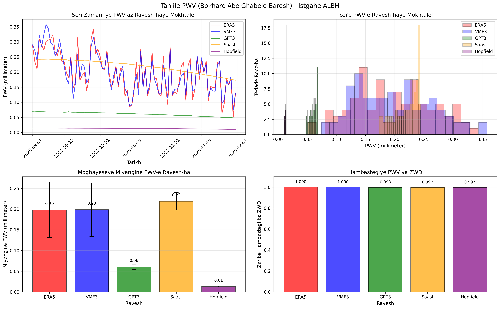

# GNSS Remote Sensing - ZWD Analysis Project


##  Project Overview

This project calculates and analyzes the **Zenith Wet Delay (ZWD)** using **5 different methods** and compares them with **IGS tropospheric products** as reference.

### Methods Used:

| # | Method | Type | Source |
|---|--------|------|--------|
| 1 | **ERA5** | Reanalysis | ECMWF |
| 2 | **VMF3** | Empirical | TU Wien |
| 3 | **Saastamoinen** | Empirical | Classical Model |
| 4 | **Hopfield** | Empirical | Classical Model |
| 5 | **GPT3** | Empirical | Global Pressure/Temperature |

### Study Station: ALBH00CAN

| Parameter | Value |
|-----------|-------|
| **Station Name** | ALBH00CAN (Victoria, Canada) |
| **Latitude** | 48.39°N |
| **Longitude** | 123.68°W |
| **Height** | 31.8 meters |
| **Type** | Coastal (5 km from Pacific Ocean) |
| **Climate** | Temperate Oceanic |
| **Study Period** | September - November 2025 (91 days) |

---

##  Key Results

### Model Performance vs IGS Reference:

| Method | RMSE (mm) | Bias (mm) | MAE (mm) | Correlation |
|--------|-----------|-----------|----------|-------------|
| **VMF3** | **24.50** | **+6.56** | **20.64** | **0.813** |
| ERA5 | 27.84 | +6.04 | 23.13 | 0.761 |
| Saastamoinen | 35.86 | +19.86 | 29.54 | 0.496 |
| GPT3 | 86.84 | -80.63 | 80.63 | 0.532 |
| Hopfield | 115.99 | -111.00 | 111.00 | 0.496 |

### Key Findings:

1.  **VMF3** and **ERA5** show the best performance
2.  **GPT3** and **Hopfield** significantly underestimate ZWD
3.  **VMF3** has the highest correlation (0.813) with IGS
4.  Coastal station shows strong correlation between ZWD and temperature (R = 0.646)
5.  Weather event detected on **2025-09-26** with ZWD increase of **69.46 mm**


##  How to Run

### 1. Install Dependencies

```bash
pip install -r requirements.txt
```

### 2. Download Required Data

>  **Important:** Due to large file sizes, raw data is not included in this repository.

| Dataset | Source | Link |
|---------|--------|------|
| ERA5 | CDS | [https://cds.climate.copernicus.eu/](https://cds.climate.copernicus.eu/) |
| IGS Troposphere | NASA CDDIS | [https://cddis.nasa.gov/](https://cddis.nasa.gov/) |
| VMF3 | TU Wien | [https://vmf.geo.tuwien.ac.at/](https://vmf.geo.tuwien.ac.at/) |
| GPT3 | TU Wien | [https://vmf.geo.tuwien.ac.at/codes/gpt3_1.grd](https://vmf.geo.tuwien.ac.at/codes/gpt3_1.grd) |
| COSMIC-2 | UCAR | [https://cdaac-www.cosmic.ucar.edu/](https://cdaac-www.cosmic.ucar.edu/) |

### 3. Run Main Analysis

```bash
cd code
python main_project.py
```

### 4. Run COSMIC-2 Analysis (Bonus)

```bash
cd code
python occultation_analysis.py
```

---

##  Outputs Generated

### Required Outputs (9 items):

| # | Output | Status |
|---|--------|--------|
| 1 | Station location map | T |
| 2 | Vertical profiles (T, P, RH) | T |
| 3 | ZWD time series (5 methods + IGS) | T |
| 4 | Difference plots vs IGS | T |
| 5 | Scatter plots vs IGS | T |
| 6 | Correlation plots | T |
| 7 | Statistical table (Bias, RMSE, MAE, Corr) | T |
| 8 | Scientific analysis of results | T |
| 9 | Weather event analysis | T |

### Bonus Output (PWV - Precipitable Water Vapor):

| Method | Mean PWV (mm) | Min (mm) | Max (mm) |
|--------|---------------|----------|----------|
| ERA5 | 0.20 | 0.05 | 0.34 |
| VMF3 | 0.20 | 0.07 | 0.36 |
| Saastamoinen | 0.22 | 0.17 | 0.24 |
| GPT3 | 0.06 | 0.05 | 0.07 |
<!-- | Hopfield | 0.01 | 0.01 | 0.01 | -->

**Correlation between PWV and ZWD: R > 0.997** 

---

##  Sample Results

### ZWD Time Series - All Methods



### Model Comparison with IGS



### Weather Event Analysis (2025-09-26)



### PWV Analysis (Bonus)



---

##  Weather Event Analysis

A significant weather event was detected on **2025-09-26**:

| Metric | Value |
|--------|-------|
| Date | 2025-09-26 |
| ZWD on event day | 142.5 mm |
| ZWD increase | 69.46 mm (from previous day) |
| Event type | Sudden moisture increase (rainfall system) |

**Performance during event:**

| Method | RMSE (mm) | Bias (mm) | Correlation |
|--------|-----------|-----------|-------------|
| VMF3 | **23.80** | +3.84 | **0.735** |
| ERA5 | 31.30 | +6.67 | 0.646 |
| Saastamoinen | 34.34 | +14.72 | -0.313 |

---

##  Methodology

### 1. ERA5 Analysis
- Extracted vertical profiles (37 pressure levels: 1000 to 1 hPa)
- Computed refractivity: `N = Nd + Nw`
- Integrated using cubic spline method
- ZWD = 10⁻⁶ × ∫ Nw dh

### 2. Empirical Models
- **Saastamoinen:** ZHD = 0.002277×P / (1 - 0.00266×cos(2φ) - 0.00000028×H)
- **Hopfield:** ZWD = 10⁻⁶ × Nw_surface × Hw/5
- **GPT3:** Harmonic coefficients interpolation

### 3. VMF3
- Direct extraction from TU Wien products
- Daily time series generation

### 4. COSMIC-2 (Bonus)
- Radio occultation profiling
- Near real-time wet profiles
- Comparison with VMF3

---

##  Bonus Section: PWV Calculation

PWV (Precipitable Water Vapor) calculated using:

```
PWV = Π × ZWD
Π = [10⁻⁶ × ρ × Rv × (k3/Tm + k'₂)]⁻¹
```

Where:
- ρ = 1000 kg/m³ (water density)
- Rv = 461.525 J/kg/K (gas constant)
- k'₂ = 24 K/hPa
- k₃ = 3.75×10⁵ K²/hPa
- Tm = 70.2 + 0.72×Ts (mean temperature)


##  License

This project is licensed under the MIT License - see the [LICENSE](LICENSE) file for details.

---

##  Contact

**Mobin Ravan**  
Email: Mobinravan23@gmail.com  
GitHub: [@mobinravan](https://github.com/mobinravan)

---

 **If you find this project useful, please give it a star!**
